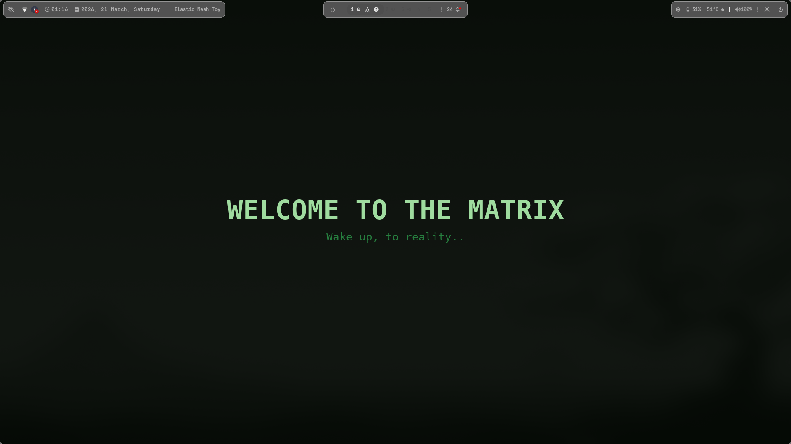
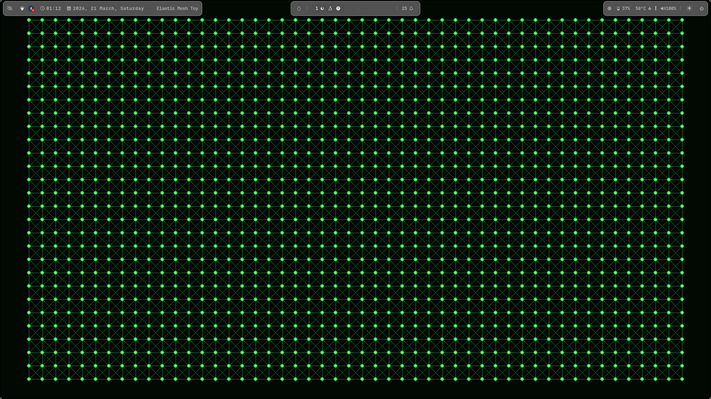
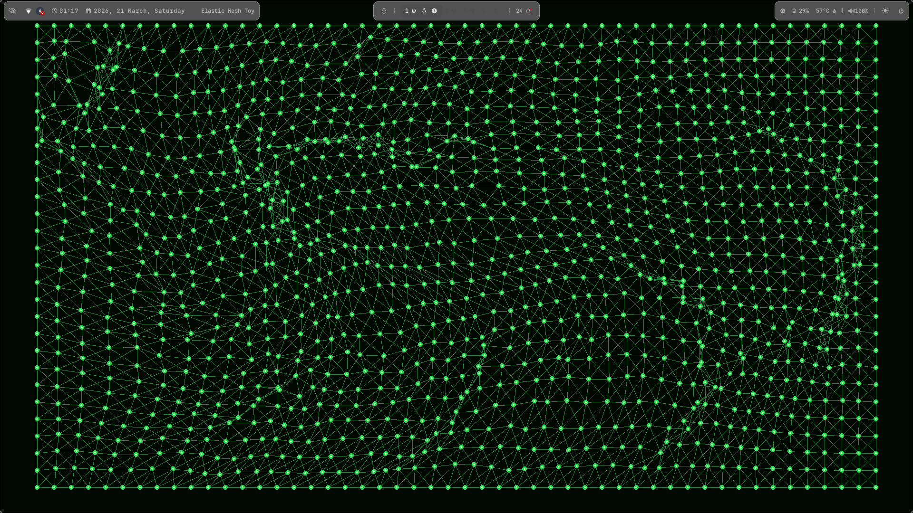

# Matrix Mesh

A minimal interactive elastic mesh desktop toy for Linux, inspired by the iconic green cyber-aesthetic of *The Matrix*.

Drag your mouse through the mesh and watch it ripple, stretch, and snap back with soft-body spring physics.

---

## Preview







---

## Features

- Interactive elastic mesh simulation
- Matrix-inspired neon green theme
- Soft-body spring physics
- Borderless desktop toy window
- Mouse-based ripple interaction
- Startup intro screen with **WELCOME TO THE MATRIX**
- Lightweight and easy to run with Python + Pygame

---

## Tech Stack

- Python
- Pygame

---

## Run Locally

Clone the repository:

```bash
git clone https://github.com/adityakumar221210008/matrix-mesh.git
cd matrix-mesh
Install dependencies:

pip install -r requirements.txt

Run the program:

python3 main.py
